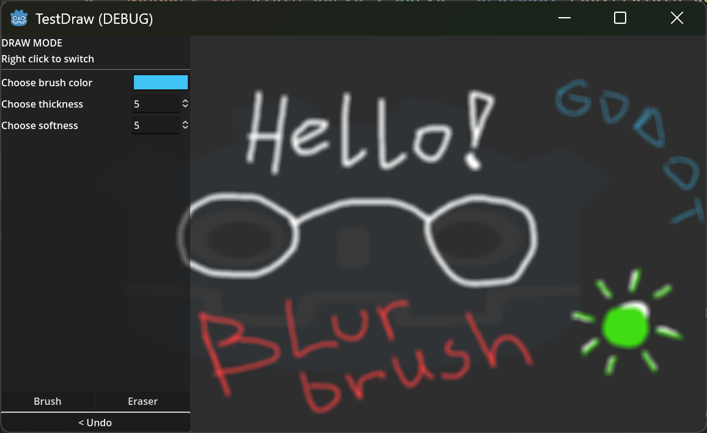

This is a small demo project to implement simple vector drawing in Godot. It uses Line2D and CanvasGroup nodes. This demo also has an erase/undo tool and supports brush softness.

# What's in it

Thanks to [StarryAlley](https://github.com/starryalley/godot-draw-eraser-demo) for original repo! The modifications I've made in my fork:

- Replaced Subviewport with a [CanvasGroup](https://docs.godotengine.org/en/stable/classes/class_canvasgroup.html) node. It should reduce the number of draw calls
- Added "brush softness" i.e. a Gaussian blur shader applied to CanvasGroup
- Simplified the code a bit and added some buttons

# Things to improve

- Add Line2D smoothing using Beziers
- Improve blur shader quality and/or efficiency
- Clean up some jankiness in input handling and `undo_last()` function
- Measure the maximum number of Line2D points Godot can handle (and come up with a caching solution if needed)
- Test and improve multiple brush softness support (I have a temporary solution in the project but I commented it out for now)

